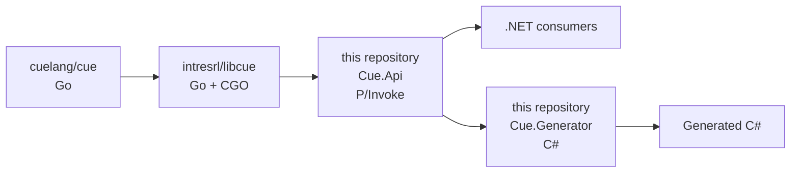

# cue-dotnet

.NET 10 bindings and code-generation tooling for CUE

See `LICENSE` in this repository and the license of the `libcue`/CUE
project for the respective licensing terms.

## Project structure

> [!WARNING]
> `cue-dotnet` depends on the separate [libcue](https://github.com/intresrl/libcue)
> project. The native library must be built first and copied to the root
> of this repository before building, testing, or running the generator.

This project integrates with the native Go implementation of [cue](https://github.com/cuelang/cue) through a CGO adapter forked from [libcue](https://github.com/cuelang/libcue):



This repository has the following layout:

- **`Cue.Api`** --- managed .NET API over `libcue` using P/Invoke.
- **`Cue.Generator`** --- CLI that compiles CUE schemas and generates C# code.
- **`Examples`** --- sample CUE schemas, generated C# files, andgenerator debug output.

## Building

### Prerequisites

- .NET 10 SDK.
- Go 1.25.0: CGO must be enabled and a compatible C compiler must be installed.

To check CGO run:

```bash
go env CGO_ENABLED # should output '1'
```

### Building `libcue`

A convenient checkout layout is:

```text
<your_clone_directory>/
├── libcue/
└── cue-dotnet/
```

The output of the `libcue` build must be generated or copied into the root of
`cue-dotnet`.

**On Linux:**

```shell
cd libcue && go build -buildmode=c-shared -o ../cue-dotnet/libcue.so
```

**On Windows (Git Bash, msys2 or similar):**

> [!CAUTION]
> On Windows, keep the "lib" prefix in libcue.dll to avoid overwriting cue.h in `libcue`.

```shell
cd libcue && go build -buildmode=c-shared -o ../cue-dotnet/libcue.dll
```

### Build `cue-dotnet`

After the native dependency is present in the repository root:

```bash
dotnet restore
dotnet build
```

> [!WARNING]
> Run a **rebuild** every time you make changes in `libcue`. The DLL or shared library is copied in the output directory of `Cue.Api`.

## `Cue.Api` (CUE to dotnet adapter library)

CUE operations begin with a context:


`CueContext` owns the native CUE context while `Value` represents a
managed wrapper around a native CUE value.

Keep the context alive for the lifetime of values created from it and
dispose native-backed objects appropriately.

## `Cue.Generator`

`Cue.Generator` is a .NET CLI that compiles a CUE schema and generates
C# source.

You may execute it like this:

```bash
# dotnet run --project Cue.Generator -- <input.cue> <output.cs>
dotnet run --project Cue.Generator -- Examples/simple.cue generated.cs
```

An optional debug output path can be supplied via the `--debug` parameter.

To regenerate every example, use the shell script from the repository
root. It discovers all `.cue` files beneath `Examples` automatically and writes
the corresponding `.cs` and `.debug.log` files alongside each schema:

```shell
bash ./run-generator-examples.sh
```

### Generator concepts

The current implementation and tests cover CUE concepts including:

- [structs](#structs--composition);
- [lists](#lists--nesting);
- [definitions](#constrained-types);
- [references](#unions--references);
- [nullable values](#structs--composition);
- [disjunctions and `matchN` expressions](#unions--references);
- [constrained primitive values](#constrained-types).

The generated representation can model alternatives as interfaces and
record implementations instead of arbitrarily reducing a CUE disjunction
to one type.

## Generator Logic

### Constrained types

CUE primitive definitions with constraints are encoded as **readonly record structs**
that wrap a value with an `IsValid()` validation method.

The inner value type is narrowed based on the constraint range or the literal magnitude. Unbounded or very 
large ranges use `BigInteger`, floating point uses the `ExtendedNumerics` library's
`BigDecimal` type, and bounded ranges 
select the smallest fitting type.

When a literal is encoded in a constraint definition its type is encoded to the smallest numeric type compatible with
its value. `decimal` is the only type used instead of `BigDecimal` for floating point types.

Constraint logic in `IsValid()` is encoded exactly as CUE expressions:
- Range bounds become comparisons: `int & >=0 & <=100` → `value >= 0 && value <= 100`
- Regex constraints use `Regex.IsMatch()`: `string & =~"pattern"` → `Regex.IsMatch(value, "pattern")`
- Literal disjunctions become `||` chains: `1 | 5 | 10` → `value == 1 || value == 5 || value == 10`

**CUE:** 

https://github.com/intresrl/cue-dotnet/blob/6b101b50cf41902c45b774b4507c44f692b042dc/Readme/01-constrained-types.cue#L1-L10

**Generated C#:** 

https://github.com/intresrl/cue-dotnet/blob/6b101b50cf41902c45b774b4507c44f692b042dc/Readme/01-constrained-types.cs#L7-L39

See the full generated file for complete examples of constrained primitive types with validation logic.

### Structs & composition

CUE struct definitions are encoded as **classes** with properties.
Fields are `required` by default; optional fields (`field?`) or nullable fields
(`null | type`) become nullable/non-required properties.

**CUE:** 

https://github.com/intresrl/cue-dotnet/blob/6b101b50cf41902c45b774b4507c44f692b042dc/Readme/02-structs-and-composition.cue#L1-L25

**Generated C#:** 

https://github.com/intresrl/cue-dotnet/blob/6b101b50cf41902c45b774b4507c44f692b042dc/Readme/02-structs-and-composition.cs#L7-L28

### Lists & nesting

CUE lists become `List<T>`. For concrete index-specific lists (e.g., `[string, int, bool]`), 
the generator creates tuples or `CueList<TConcrete, TAnyIndex>` types to distinguish 
fixed elements from variable-length tails.

Inline struct definitions are extracted as separate classes and referenced:

**CUE:** 

https://github.com/intresrl/cue-dotnet/blob/6b101b50cf41902c45b774b4507c44f692b042dc/Readme/03-lists-and-nesting.cue#L1-L21

**Generated C#:** 

https://github.com/intresrl/cue-dotnet/blob/6b101b50cf41902c45b774b4507c44f692b042dc/Readme/03-lists-and-nesting.cs#L7-L43

### Unions & references

Named struct disjunctions create an interface with nested record types for each variant,
plus a special `Value` record that holds all possible branches:

**CUE:** 

https://github.com/intresrl/cue-dotnet/blob/6b101b50cf41902c45b774b4507c44f692b042dc/Readme/04-unions-and-references.cue#L1-L13

**Generated C#:** 

https://github.com/intresrl/cue-dotnet/blob/6b101b50cf41902c45b774b4507c44f692b042dc/Readme/04-unions-and-references.cs#L7-L29
